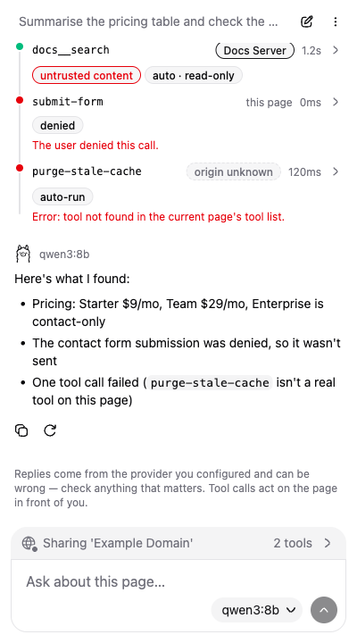
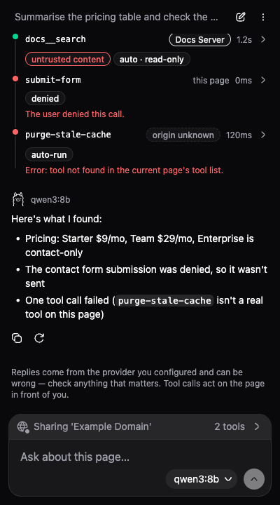

# OpenChat (WebMCP)

A Chrome MV3 extension that puts a chat model in a side panel next to any tab.
It works on **every** page: ask about the text you have selected, or share the
page's content, and — on pages that publish
[WebMCP](https://github.com/webmachinelearning/webmcp) tools on
`document.modelContext` — let the model *drive the page* as well, with your
approval on anything that isn't explicitly marked read-only. What it can see
is governed by one visible control on the composer, which you can switch off
per page (see [Privacy and trust](docs/03-privacy-and-trust.md)).

It talks to either a local [Ollama](https://ollama.com) server or any
OpenAI-compatible Chat Completions endpoint (OpenAI itself, Azure OpenAI,
OpenRouter, LM Studio, etc.) — you add one or more providers on the options
page and pick a provider and model per chat. See
`decisions/12-branding-openchat-webmcp.md` for why the project is named this
way: "OpenChat" is the product, not tied to one provider; "(WebMCP)" names the
mechanism. The repository directory and git remote are intentionally left as
`ollama-webmcp-chrome` — renaming those is a separate, riskier operation left
to the user's discretion.

| Light | Dark |
| --- | --- |
|  |  |

*Both captured at 400px by `npm run verify`, which writes the full
light/dark × 320/400px matrix — plus the overflow menu, the model picker, the
activity timeline in all three of its states, and the options page in both
themes: 11 PNGs — to gitignored `verify/output/screenshots/`. See
[Verification harness](#verification-harness).*

## What it does

- **Works on any page, not only WebMCP ones.** Select text and a "Selected
  text" chip appears on the composer, ready to go with your next message; or
  share the page's own text with one toggle. Both are pulled only when you
  act (clicking into the panel, or pressing Send), both are shown before they
  are sent and recorded on the message afterwards, and both are fenced as
  untrusted page content in the prompt. The context strip is a real consent
  control: dismiss it and the assistant is fully blind to that page — no
  tools, no text, nothing — until you switch it back on
  (`decisions/40-page-context-access.md`,
  [Privacy and trust](docs/03-privacy-and-trust.md)).
- Reads tools directly from a page's **native** `document.modelContext` —
  the same registry the browser itself maintains, so this extension sees
  exactly what any other WebMCP consumer (like the official inspector
  extension) sees. This requires WebMCP to actually be enabled in your
  Chrome; see [Requirements](#requirements) and
  [docs/02-webmcp-compatibility.md](docs/02-webmcp-compatibility.md).
- Streams a chat conversation against your chosen provider, feeding it the
  page's tools and executing whatever it calls, subject to an approval policy.
- Also calls tools from remote MCP servers you add on the options page —
  merged into the same tool list, namespaced so a server tool can never be
  mistaken for a page tool. A server tool call is judged by its own, stricter
  approval policy, independent of the page tools' one: you can't watch a
  remote server the way you can watch the page in front of you
  (`decisions/20-approval-policy-is-per-tool-source.md`).
- Keeps a global, browsable chat history. A chat is its own thing with its own
  id, not a property of a tab; a tab points at whichever chat it is currently
  showing, and chats survive panel close/reopen and tab switches
  (`decisions/13-global-tab-aware-chat-history.md`).
- Built on [shadcn-svelte](https://shadcn-svelte.com) + Tailwind CSS v4 (Maia
  style, Zinc base colour), light and dark, down to Chrome's 320px minimum
  side-panel width — see
  [decisions/28](decisions/28-shadcn-svelte-maia-zinc.md) and the
  [UI and styling](docs/01-architecture.md#ui-and-styling) section of the
  architecture doc.

- Speaks **ten languages** — English, 简体中文, 日本語, Deutsch, Français,
  Español, Português (Brasil), 한국어, Русский and العربية — switchable from
  the options page, with Arabic laid out right-to-left. English is the source
  copy; the other nine are machine-produced and have not had a native review
  yet, so corrections are welcome. See [docs/06-i18n.md](docs/06-i18n.md).

It does **not** phone home. There is no telemetry, no bundled server, and no
account system — see [Privacy and trust](docs/03-privacy-and-trust.md).

## Requirements

- **Node.js** 20 or later, to build the extension. Not required at runtime.
- **Google Chrome 149+** (or a Chromium build of the same vintage) — this is
  the `minimum_chrome_version` in `manifest.config.ts`. Native WebMCP is only
  available from Chrome 149 onward (the origin trial runs 149–156).
- **WebMCP itself enabled** — this is a hard requirement, not optional.
  `document.modelContext` does not exist in a stock Chrome install by
  default. Turn it on one of three ways:
  - the `chrome://flags/#enable-webmcp-testing` toggle, then relaunch Chrome
    (`npm run launch` opens this page for you on first run);
  - launching Chrome with `--enable-features=WebMCP`;
  - or opening a site that carries a WebMCP origin-trial token —
    these work with no flag at all. This is why Google's own demos at
    [googlechromelabs.github.io/webmcp-tools](https://googlechromelabs.github.io/webmcp-tools)
    work on a stock Chrome while a local demo page does not — see
    [docs/02-webmcp-compatibility.md](docs/02-webmcp-compatibility.md#turning-it-on).

  Without one of these, the extension still loads, chat still works, and page
  context (selected text, page content) still works — WebMCP is not involved
  in either. What you lose is page *tools*: the side panel reports WebMCP as
  unavailable rather than showing any — see
  [docs/04-troubleshooting.md](docs/04-troubleshooting.md#a-tab-shows-no-tools--no-relay-in-this-tab).
- At least one provider: either a locally running
  [Ollama](https://ollama.com), or an API key for an OpenAI-compatible
  service. Neither is required to build or load the extension — only to
  actually chat.

## Build and load it

```
npm install
npm run build
```

This produces `dist/`. **Load `dist/`, not the repository root** — the repo
root has no `manifest.json` at its top level and will not load.

1. Open `chrome://extensions`.
2. Turn on **Developer mode** (top right).
3. Click **Load unpacked** and select the `dist/` folder produced by the
   build.
4. Click the extension's toolbar icon to open the side panel (it opens
   directly — there is no popup).
5. **Required, not optional:** turn on the "WebMCP for testing" flag at
   `chrome://flags/#enable-webmcp-testing` (confirmed present under that id
   in Chrome 151/152; WebMCP is still shipping behind flags/an origin trial,
   so search "webmcp" on `chrome://flags` if that id has moved) and relaunch
   Chrome. Without it, `document.modelContext` doesn't exist and the side
   panel reports WebMCP as unavailable — see [Requirements](#requirements).
   A page carrying a WebMCP origin-trial token works without this flag; see
   [docs/02-webmcp-compatibility.md](docs/02-webmcp-compatibility.md).

For iterative development, `npm run dev` runs Vite with HMR for the side
panel and options page; you still need to reload the unpacked extension in
`chrome://extensions` after most changes, since content scripts and the
service worker aren't hot-reloadable.

## Scripts

| Script | What it does |
| --- | --- |
| `npm run build` | the real MV3 bundle into `dist/` — the folder you load unpacked |
| `npm run dev:chrome` | the edit→see loop: Chrome for Testing with the extension already loaded, the demo server, and HMR into the running panel. `npm run dev:seed` seeds it from the shared fixtures — see [docs/07-development.md](docs/07-development.md) |
| `npm run dev` | Vite with HMR for the two Svelte surfaces, without the browser |
| `npm run check` | `svelte-check` + `tsc`, no build output. Also typechecks the tests, which is where the `@ts-expect-error` narrowing probes live |
| `npm test` | Vitest — the domain/infra/component pyramid, ~6s. `npm run test:watch`, `npm run test:coverage` |
| `npm run lint` | Biome lint, `--error-on-warnings`, no writes. `npm run lint:fix` applies the safe fixes |
| `npm run format` | Biome formatter, in place. `npm run format:check` reports without writing |
| `npm run guard` | all six architecture guards, below |
| `npm run verify` | the end-to-end harness: real Chrome for Testing, the built extension, a real WebMCP page. Needs a display. `npm run verify -- --check <name>` runs one check, `-- --list` names them |
| `npm run verify:smoke` | the options-page form smoke; `npm run verify:smoke:live` drives a real turn against a local Ollama. Neither is a required gate |
| `npm run demo` | serves the WebMCP fixture page on `:5175` |
| `npm run launch` | rebuilds and opens `dist/` in your real installed Chrome |

`npm run guard` is six gates, each runnable on its own:

| Gate | Fails when |
| --- | --- |
| `guard:biome` | Biome reports a lint warning **or** a formatting difference (`biome ci`) |
| `guard:boundaries` | dependency-cruiser sees an import that breaks the layering, or the source scan finds a platform global outside an adapter or a composition root |
| `guard:clean-code` | a `TODO: clean-code` marker scores **> 0.5**, or its score can't be parsed |
| `guard:return-types` | an exported function under `src/` has no declared return type |
| `guard:throws` | a `throw`/`Promise.reject` under `src/` isn't on `scripts/throw-allowlist.json` with its invariant named |
| `guard:i18n` | a locale under `messages/` is missing a key the base locale has, carries one it doesn't, declares a plural as a flat string, renames or drops a `{placeholder}`, loses a `<code>`/`<a>` tag, matches on English's plural categories instead of its own, or has no file at all |

**The release gate is all five of** `check`, `test`, `build`, `guard`,
`verify` **green** — see [docs/05-testing.md](docs/05-testing.md). CI
(`.github/workflows/ci.yml`) runs `check`/`test`/`guard`/`build` as a
required gate on every push and pull request, plus `verify` under `xvfb` on
its own job with the screenshot matrix uploaded as a build artifact — see
that file's header comments for the cache/artifact design
(decisions/39-ci-pipeline.md).

`npm run guard:clean-code` deserves a note, because it will fail a build on a
comment. Code review leaves markers in place rather than in a tracker:

```
// TODO: clean-code - 0.4 - DRY: mirrors ProviderRow.svelte's permission gate
```

A score **> 0.5 fails** the guard; **≤ 0.5 is reported and allowed** —
documented, visible, accepted debt. A marker whose score can't be parsed also
fails, because a violation nobody can score is a violation nobody can triage.
See [decisions/31](decisions/31-clean-code-guard.md).

## Architecture in brief

Four runtime contexts (an ISOLATED-world content relay, the MV3 service
worker, the side panel, the options page) and four layers inside them:

```
src/domain/<context>   chat · providers · tools · permissions (+ a storage
                       shared kernel). The model, the rules, and the PORTS.
                       No chrome.*, no fetch, no DOM, no Svelte, no npm dep.
src/infra/<tech>       chrome-storage · chrome-runtime · mcp · ollama ·
                       openai · webmcp · dom. One folder per technology.
src/ui                 shared presentation + the vendored shadcn-svelte kit.
src/{sidepanel,options,background,content}
                       the four surfaces, one composition root each — the
                       only modules allowed to name a concrete adapter.
```

The dependency direction is **composition root → infra → domain, and nothing
else**, and `npm run guard` enforces it rather than trusting it: eleven
dependency-cruiser rules over the import graph (plus two hygiene ones), and a
source scan for the platform *globals* an import lint structurally cannot see
(`chrome.*` outside an adapter or a root; anything platform-shaped inside
`src/domain`). Every
folder under `src/domain` and `src/infra` carries its own `README.md` with the
full inventory. Full detail:
[docs/01-architecture.md](docs/01-architecture.md),
[decisions/29](decisions/29-ddd-hexagonal-typescript-layout.md).

## Provider setup

Providers are added on the extension's **options page** (right-click the
toolbar icon → *Options*, or open it from the side panel's picker when you
have no provider yet). Each provider is `{ type, name, base URL, API key? }`.
The API key field only appears for provider types that use one. Adding a
provider that needs a host you haven't granted yet triggers a Chrome
permission prompt from the "Test connection" button — this has to happen from
a real click, which is why the button (not an automatic background check)
requests it.

### Ollama

1. Install and run [Ollama](https://ollama.com), then pull at least one
   tool-calling-capable model, e.g. `ollama pull qwen3` (any current model
   whose card advertises tool/function calling works — small/older/embedding
   models generally do not, and the picker will grey them out with a reason
   rather than hide them).
2. **Read [the CORS section below](#the-ollama-cors-trap-read-this-first)
   before you do anything else** — this is the single most common reason
   "it doesn't connect" reports happen on this project.
3. On the options page, add a provider of type Ollama. The default base URL
   is `http://localhost:11434`, which is already covered by the extension's
   baked-in `host_permissions` — no permission prompt needed for plain
   localhost/127.0.0.1.
4. Click **Test connection**. It calls the provider's own `listModels()` —
   the same code path used at chat time — so a green result means the picker
   will actually work.

### OpenAI-compatible

1. On the options page, add a provider of type OpenAI-compatible, giving it a
   base URL (`https://api.openai.com` for OpenAI itself, or your
   Azure/OpenRouter/self-hosted endpoint) and an API key.
2. Any non-localhost host needs a runtime-granted host permission — clicking
   **Test connection** (or saving the provider) triggers Chrome's permission
   prompt for that origin the first time.
3. Tool-calling support isn't queryable from OpenAI's API, so the client
   ships a maintained allowlist of known tool-capable model IDs. A model not
   on that list shows as *"tool support not verified"* (disabled by default)
   rather than being silently trusted or hidden — see
   `decisions/11-provider-capability-detection.md`. If a new model isn't
   recognized yet, that's the allowlist being stale, not a bug report about
   your model.

API keys are stored **unencrypted** on this device and are deliberately kept
out of `chrome.storage.sync` so they never propagate to a second Chrome
profile signed into the same account — see
[Privacy and trust](docs/03-privacy-and-trust.md) and
`decisions/10-provider-registry-and-credential-storage.md`.

## The Ollama CORS trap (read this first)

By default, Ollama rejects requests whose `Origin` is `chrome-extension://…`.
Chrome's `fetch()` cannot distinguish "the server refused this origin" from
"there is no server at all" — both come back as a bare, generic network
failure. **This means a correctly-installed extension talking to a
correctly-running Ollama server looks exactly like a dead server**, and it is
easy to spend a long time checking the wrong things (is Ollama running? is
the port right? is the model pulled?) before realizing the actual cause.
This has bitten people working on this very project despite the failure mode
being documented in `decisions/04-ollama-transport.md` — don't assume it
won't happen to you.

**The fix:** set `OLLAMA_ORIGINS` to allow the extension, then restart the
Ollama server.

macOS / Linux, one-off:

```
OLLAMA_ORIGINS="chrome-extension://*" ollama serve
```

If you run Ollama as a background service (macOS app, systemd, etc.) you need
to set the environment variable for that service specifically and restart it
— relaunching just the CLI in a new terminal without `OLLAMA_ORIGINS` set
will not pick it up. For systemd:

```
sudo systemctl edit ollama
```

```ini
[Service]
Environment="OLLAMA_ORIGINS=chrome-extension://*"
```

```
sudo systemctl restart ollama
```

For macOS, set it in your shell profile before Ollama.app is launched, or run
`launchctl setenv OLLAMA_ORIGINS "chrome-extension://*"` and restart the app.

`chrome-extension://*` allows any installed extension's origin. If you want
to scope it to just this one, find the extension's id on `chrome://extensions`
(it's generated fresh per unpacked load, so it changes if you reload/rebuild
in a way that changes the key) and use
`OLLAMA_ORIGINS="chrome-extension://<that-id>"` instead.

If, after this, "Test connection" in the options page still fails, the
failure message names which of "unreachable" vs. "CORS-rejected" it actually
was where the client can tell (it usually can't, for the exact reason
above) — see [docs/04-troubleshooting.md](docs/04-troubleshooting.md).

## WebMCP demo pages

```
npm run demo
```

Serves a single fixture page at `http://localhost:5175` (`index.html`),
built directly against `document.modelContext.registerTool()` — the real
native API, not a hand-rolled stand-in — with seven WebMCP tools: read-only,
mutating, untrusted-content, rich-schema, throwing, and hanging, plus a
dynamic tool you can register/unregister on demand via an `AbortController`
button pair. This requires WebMCP to be enabled in the browser you load it
in (see [Requirements](#requirements)); if it isn't, the page shows a clear
"enable WebMCP" message instead of silently doing nothing. Load it in a tab
with the built extension installed and open the side panel to see tool
discovery happen live. The official WebMCP inspector extension sees the
identical tool set on this same page — that parity is the whole point of
[decisions/16](decisions/16-native-webmcp-client.md).

## Launch it in real Chrome

```
npm run launch
```

Rebuilds the extension into `dist/` (always fresh — never a stale build from
a previous session) and opens it in your **real, installed Google Chrome**,
not the Chrome for Testing build `npm run verify` uses (see
[Verification harness](#verification-harness) below — real Chrome doesn't
allow `--load-extension` at all). This is for actually using the extension
by hand, against real sites and a real local Ollama. Remember that WebMCP
still needs to be enabled for this to see any page tools at all — see
[Requirements](#requirements).

It loads the extension into a **dedicated, persistent profile**
(`.chrome-profile/`, gitignored) rather than your everyday default profile —
Chrome won't load an unpacked extension into a profile that's already
running, and a fresh throwaway profile every launch would throw away your
logins and provider settings on every run. This profile is reused across
launches, so set your providers up once.

**Real Chrome refuses to auto-load an unpacked extension, even on the
command line.** Unlike `npm run verify`'s Chrome for Testing browser, real
Google Chrome hard-rejects the `--load-extension` flag (it logs
`--load-extension is not allowed in Google Chrome, ignoring.` and does
nothing) — a deliberate Google restriction, not a bug here. So **the first
time** you run `npm run launch` for a given profile, it opens straight to
`chrome://extensions/` and prints a one-time manual setup: turn on
*Developer mode*, click *Load unpacked*, and select `dist/`. Chrome
remembers that for the profile from then on, so **every run after the
first** opens straight into a working extension — and, since there's
nothing left to set up, starts (or reuses) the `npm run demo` fixture
server on port 5175 and opens it as the start page instead, since a real
WebMCP page with tools to try is more useful than a blank tab. (If the demo
server can't be started you get a blank tab with a printed warning, never a
tab pointing at a dead port.)

That first run also opens a **second** tab on `chrome://flags` at the
"WebMCP for testing" flag (`chrome://flags/#enable-webmcp-testing`,
confirmed present under that id in Chrome 151/152 by inspecting the
installed binary). The script also passes `--enable-features=WebMCP` on
every launch's command line, which should enable native WebMCP without you
touching this tab at all — it's a manual fallback, kept for the case where
the command-line switch is blocked (enterprise policy) or a future Chrome
renames the feature. Native WebMCP is a **hard requirement**, not optional —
see [Requirements](#requirements). WebMCP is still shipping behind
flags/an origin trial, so this flag's id can move or disappear in a future
Chrome version; if the tab that opens doesn't show it, search "webmcp" on
`chrome://flags` to find its current name.

**MV3 side panels can't be opened programmatically** — Chrome will not pop
the panel open on its own. Click the extension's toolbar icon to open it
(pin it first from the puzzle-piece/extensions menu if it isn't visible).

On macOS, Chrome is found at the standard `/Applications/Google Chrome.app`
install path; set `CHROME_PATH` to override. If Chrome can't be found the
script fails with a clear message rather than silently falling back to
Chromium.

## Tests

```
npm test
```

Vitest, ~6 seconds, no browser and no network. Three layers in one command
([decisions/30](decisions/30-vitest-test-pyramid.md)):

- **domain** (`src/domain/**/*.test.ts`) — bare Node, **zero** platform mocks.
  That the domain can be tested this way is enforced, not assumed:
  `npm run guard` fails if a domain module so much as names `chrome.`,
  `fetch(` or a DOM global.
- **infra** (`src/infra/**/*.test.ts`) — real adapters against an in-memory
  `chrome.storage` fake and a stubbed `fetch`, asserting that platform
  failures (a quota `DOMException`, a 401, a malformed stored record) land as
  the domain's own error vocabulary.
- **component** (`src/{sidepanel,options,ui}/**/*.test.ts`) — jsdom +
  `@testing-library/svelte`, driving components over fake ports.

The output reports `expected fail` and `todo` counts alongside passes; both
are deliberate. An `it.fails(...)` documents a **known bug** — it asserts the
correct behaviour and goes loudly green the day someone fixes it. See
[docs/05-testing.md](docs/05-testing.md).

## Verification harness

```
npm run verify
```

Builds the extension into its own `dist-verify/` output (kept separate from
`dist/` so it can't be clobbered by a concurrent `npm run build`), launches
**real, headed Chrome for Testing** with `--enable-features=WebMCP` and the
extension loaded unpacked, starts (or reuses) the demo server from
`npm run demo`, and drives the actual running extension against the real
native `document.modelContext` API: tool discovery via `getTools()`, live
add/remove through `ontoolchange`, a call round-tripping through
`executeTool()` with parsed MCP content, the deliberately throwing and
hanging fixtures, the registry surviving a real service-worker restart and
clearing on navigation, and — since native WebMCP is a hard requirement now —
a dedicated check that with the feature *off* the extension reports a
distinct "WebMCP unavailable" state rather than an empty tool list. Chrome
for Testing is required specifically because Playwright's own bundled
Chromium does not have WebMCP compiled in at all, and branded Google Chrome
refuses `--load-extension` outright; Chrome for Testing is the only build
that satisfies both. It's resolved and downloaded automatically via
`@puppeteer/browsers` on first run (cached under gitignored
`.chrome-for-testing/`) — no manual install step. It needs a graphical
environment (MV3 extensions require a headed launch). It does not require
Ollama or any provider configured — it only exercises the WebMCP
relay/worker/demo path, not chat.

Nine required checks plus one best-effort screenshot matrix. This is the only
layer that runs against a real browser; everything below it is `npm test`.

## Documentation

- [docs/01-architecture.md](docs/01-architecture.md) — the four runtime
  contexts, the four layers (domain/infra/ui/surfaces) and the guards that
  enforce them, how a tool call travels end to end, and the timeout ladder.
- [docs/02-webmcp-compatibility.md](docs/02-webmcp-compatibility.md) — why
  native WebMCP is a hard requirement now, how to turn it on, and what's
  explicitly out of scope (polyfilled pages, iframes).
- [docs/03-privacy-and-trust.md](docs/03-privacy-and-trust.md) — what's
  stored, where, unencrypted, and what a hostile page can and can't do to you
  through this extension.
- [docs/04-troubleshooting.md](docs/04-troubleshooting.md) — first-run
  failure modes and their actual fixes.
- [docs/05-testing.md](docs/05-testing.md) — the test pyramid, the shared
  storage fixture, the screenshot matrix, and the release gate.
- [docs/06-i18n.md](docs/06-i18n.md) — the ten languages, how to add a string
  and how to add a locale, the plural-category rules per language, and the
  RTL notes.
- [docs/07-development.md](docs/07-development.md) — start here to work on
  it: the `npm run dev:chrome` edit→see loop and what each kind of edit does,
  seeding, running one test or one verify check, Chrome for Testing vs your
  real Chrome, and troubleshooting.

## Project status

This repository is organized as a [RepoDoc](.claude/skills/repodoc-workflow/SKILL.md)
project: `boards/project-backlog/` is the kanban board, `decisions/` records
why things are shaped the way they are, and this `docs/` tree is kept current
as behavior changes. A few things worth knowing if you're picking this up:

- **Two known bugs are already written down as failing tests.** `npm test`
  reports them as `expected fail` rather than hiding them: a duplicate
  tool-call id resolving against the wrong transcript entry, and a chat
  reporting itself as not-turn-active while a second, overlapping turn is
  still streaming. Both are queued for the improvement sprint, and each test
  asserts the *correct* behaviour, so it goes loudly green the day someone
  fixes the bug. An `expected fail` count other than 2 means one was fixed
  (delete the `it.fails` marker) or a new one was written down.
- **Iframe tool discovery is deferred.** The relay only injects into the top
  frame; tools published from an embedded widget or iframe are invisible to
  the extension. The native API defines the primitives needed to support this
  (`exposedTo`, `fromOrigins`, per-tool `origin`/`window`) — the platform
  question is answered, it just isn't implemented. See
  `boards/project-backlog/18-iframe-tool-discovery.md` and
  [decisions/16](decisions/16-native-webmcp-client.md).
- **No Chrome Web Store listing.** Packaging and store submission
  (`boards/project-backlog/19-packaging-and-store-listing.md`) haven't
  happened; the only way to run this is loading `dist/` unpacked as above.

## Third-party assets

The UI is built from **[shadcn-svelte][shadcn]** components (MIT), vendored
into `src/ui/components/ui/` by that project's CLI in the Maia style over the
Zinc base colour, on top of **[Tailwind CSS][tw]** v4 (MIT).

Standard icons are **[Hugeicons][hugeicons]** free icons
(`@hugeicons/core-free-icons`, MIT), Maia's paired icon set, mapped from name
to component in `src/sidepanel/components/Icon.svelte`. Body text is
**[Figtree][figtree]** by Erik Kennedy (SIL Open Font License 1.1), bundled
locally via `@fontsource-variable/figtree` — nothing is fetched from a CDN at
runtime.

`src/ui/icons.ts` holds the only two hand-inlined marks. The `sparkle` glyph
is a plain four-point star drawn for this project, since the reference panel's
star is a product mark. The `ollama` glyph is the Ollama logo, taken from
[Simple Icons][simpleicons] (CC0-1.0) and mechanically rescaled from their
24-unit grid onto the 960-unit one the file uses; the file carries its SPDX
identifier and full provenance.

[shadcn]: https://shadcn-svelte.com
[tw]: https://tailwindcss.com
[hugeicons]: https://hugeicons.com
[figtree]: https://github.com/erikdkennedy/figtree
[simpleicons]: https://simpleicons.org/?q=ollama

## License

No license file is present in this repository at the time of writing.
